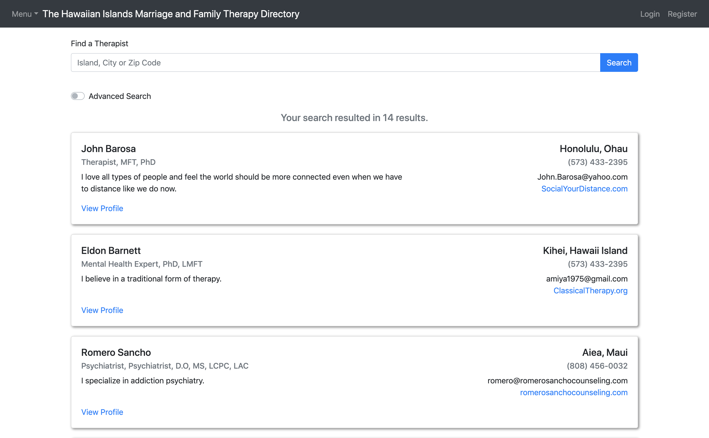
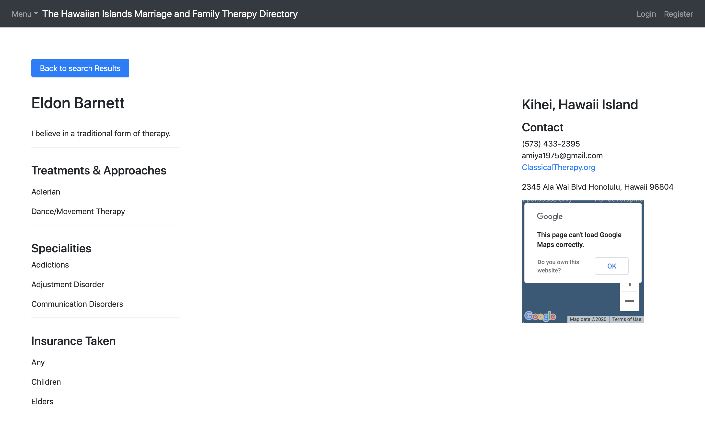

# HIAMFT web based directory project

## Description 

_Duration: 2 Week Sprint_

Our client had the challenge of managing HIAMFT's members uning spreedsheets which is less efficient and time consuming. It also made it difficult for potential clients and therapist to connect as they are spread out throughout the islands of Hawaii.Thereby limiting mental health care access for those who may need it. 

HIAMFT directory is a web based direcotry developed to promote the common professional interest of marriage and family therapists, as well as to support its members and educate the public. It enables member therapists create a profile, edit their profile information, allow users to search and connect with a therapist locally and enable the adminstrators to manage the directory and HIAMFT association so much easier. 

The aim of this web based directory is to help HIAMFT memebrs reach more clients, organize themselves better and promote their common professional interests. In doing so be able to increase mental health accesibility on the islands of Hawaii and help HIAMFT members become succesful in their profession.
 
To see the fully functional site, please visit: 

## Built with

- Node
- Express
- React
- Redux
- Sagas
- PostgreSQL
- Passport
- Axios
- React
- CSS
- Heroku
- Google Map API 
- FileSaver 
- React Bootstrap
- NodeMailer

## Installation 

1. Create a database named hawaii_mft.
2. The queries in the database.sql file are set up to create all the necessary tables and populate the needed data to allow the application to run correctly. The project is built on Postgres, so you will need to make sure to have that installed. We recommend using Postico to run those queries as that was used to create the queries,
3. Open up your editor of choice and run an npm install in the terminal
4. Run npm run server in your terminal
5. Run npm run client in your terminal
6. The npm run client command will open up a new browser tab for you!

## Prerequisites

- [Node.js](https://nodejs.org/en/)
- [PostrgeSQL](https://www.postgresql.org/)
- [Nodemon](https://nodemon.io/)

## Acknowledgement

Thanks to Prime Digital Academy who equipped and helped us make this web based directory a reality. Thank you to John and HIAMFT for letting us tackle this problem and build this web application. Thank you to my teammates for working really hard to make this a reality. 

## Support

If you have suggestions or issues, please email me at damewold@gmail.com. 

